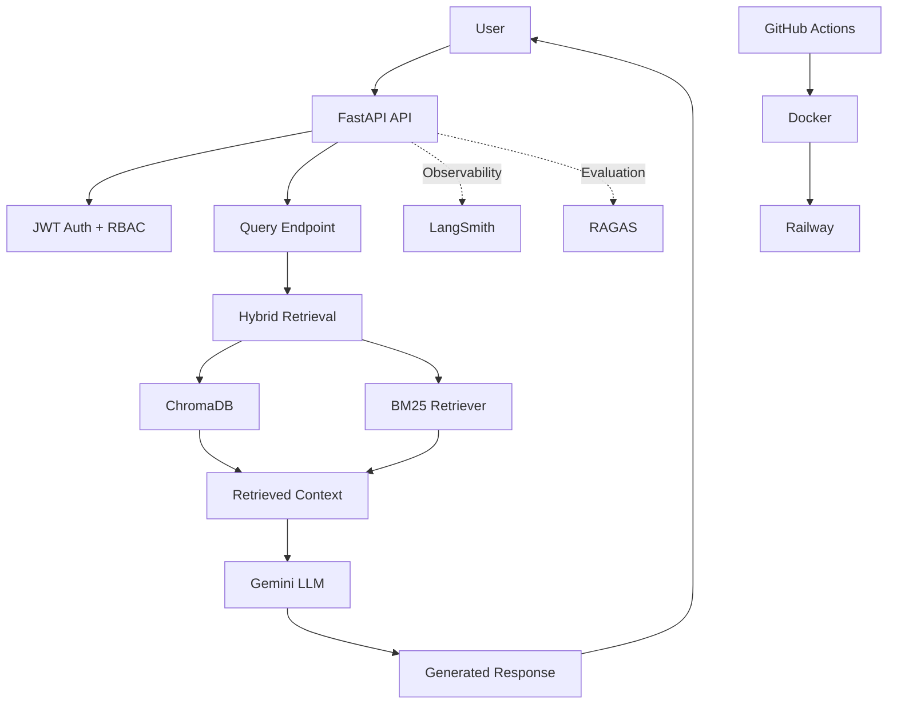

# Architecture Diagram

```mermaid
flowchart TD

U[User]

A[FastAPI API]

AUTH[JWT Auth + RBAC]

Q[Query Endpoint]

HR[Hybrid Retrieval]

C[ChromaDB]

B[BM25 Retriever]

CTX[Retrieved Context]

G[Gemini LLM]

R[Generated Response]

LS[LangSmith]

RG[RAGAS]

GH[GitHub Actions]

D[Docker]

RW[Railway]

U --> A

A --> AUTH
A --> Q

Q --> HR

HR --> C
HR --> B

C --> CTX
B --> CTX

CTX --> G

G --> R

R --> U

A -. Observability .-> LS

A -. Evaluation .-> RG

GH --> D

D --> RW
```