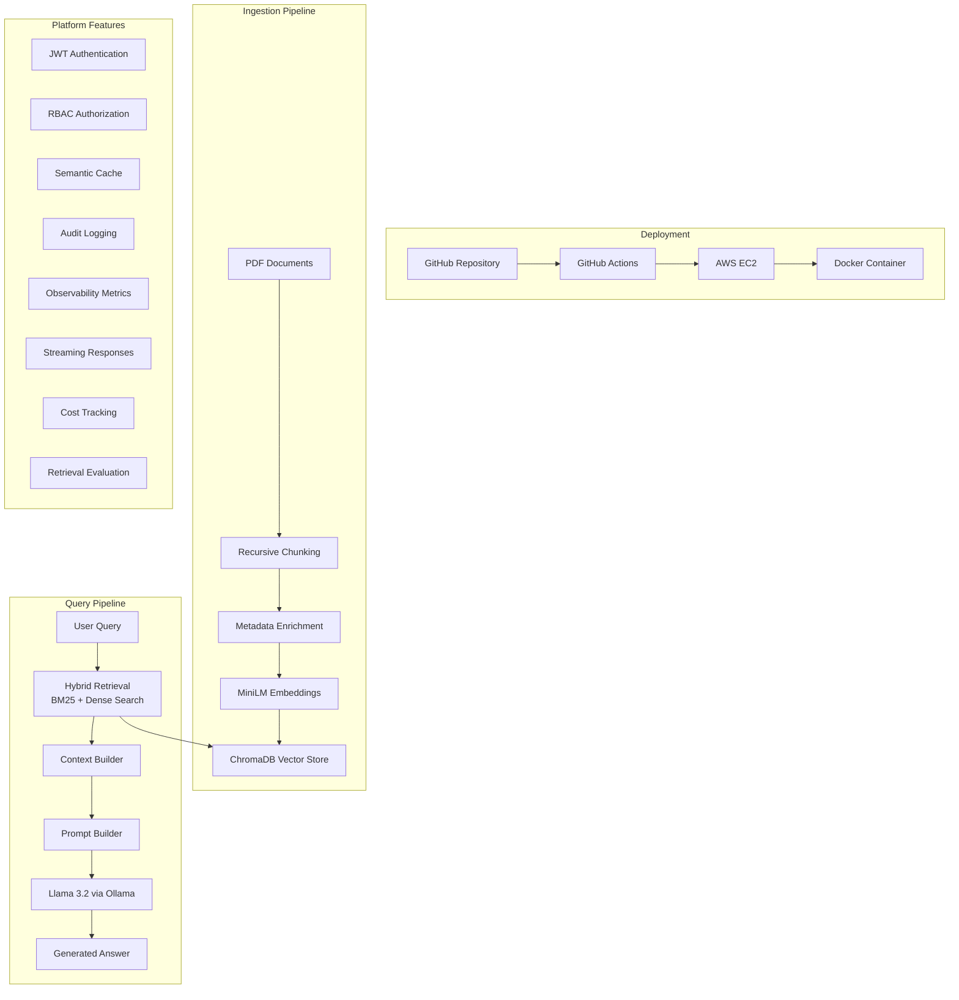

# Enterprise RAG Platform Architecture

```mermaid
flowchart TB

subgraph Deployment
    GITHUB[GitHub Repository]
    CICD[GitHub Actions]
    AWS[AWS EC2]
    DOCKER[Docker Container]

    GITHUB --> CICD
    CICD --> AWS
    AWS --> DOCKER
end

subgraph Ingestion Pipeline
    PDF[PDF Documents]
    CHUNK[Recursive Chunking]
    META[Metadata Enrichment]
    EMBED[MiniLM Embeddings]
    CHROMA[ChromaDB Vector Store]

    PDF --> CHUNK
    CHUNK --> META
    META --> EMBED
    EMBED --> CHROMA
end

subgraph Query Pipeline
    USER[User Query]
    RETRIEVAL[Hybrid Retrieval<br/>BM25 + Dense Search]
    CONTEXT[Context Builder]
    PROMPT[Prompt Builder]
    LLM[Llama 3.2 via Ollama]
    ANSWER[Generated Answer]

    USER --> RETRIEVAL
    RETRIEVAL --> CHROMA
    RETRIEVAL --> CONTEXT
    CONTEXT --> PROMPT
    PROMPT --> LLM
    LLM --> ANSWER
end

subgraph Platform Features
    JWT[JWT Authentication]
    RBAC[RBAC Authorization]
    CACHE[Semantic Cache]
    AUDIT[Audit Logging]
    METRICS[Observability Metrics]
    STREAM[Streaming Responses]
    COST[Cost Tracking]
    EVAL[Retrieval Evaluation]
end
```
